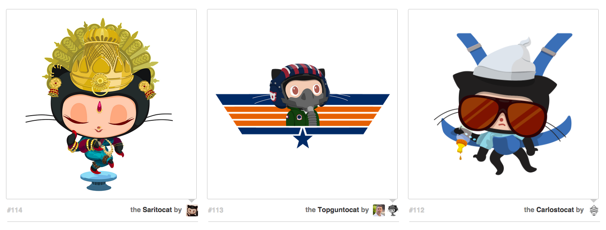

## You Should Know
- HTML
- CSS Layout

## Your Mission
Let's duplicate an image using a given HTML page, [`index.html`](index.html), and an inspiration image:


### Explore Mode

**Challenge #1.1**: Fork this repo and modify [index.html](index.html) and add your own CSS to make it look like the image above. Your CSS should be in a separate file called `styles.css`. 
**Goal #1.1**: Add a custom stylesheet to `index.html`.

**Challenge #1.2**: Make sure your project is safe! Create a git repository containing your project files and upload it to Github.
**Goal #1.2**: Submit your Github URL below.

### Adventure Mode

**Challenge #2.1:** Let's practice writing some custom HTML as well. Follow the pattern in `index.html` and add 3 more Octocats to your web page. Use the Octodex at [http://octodex.github.com](http://octodex.github.com) if you need some images, or draw your own and include them in your Github repository!
**Goal #2.1:** Submit your updated Github URL below.

### Epic Mode

**Challenge #3.1:** Try making your web page responsive when the browser is resized. Here's a hint: consider what CSS rules you know that determine how many items are displayed inline.
**Goal #3.1:** Submit your updated Github URL below. 

## Requirements for Completion
- A Github URL containing:
  - `index.html`
  - `styles.css`

## You Will Need
- A file called `index.html` with the following markup:
```
<!doctype html>
<html lang="en">
<head>
  <title>Octodex</title>
<!-- link to your stylesheet -->
</head>
<body>
<ul class="octodex">
  <li class="octocat">
    <a href="https://octodex.github.com/saritocat">
      
    </a>
    <div class="image-footer">
      <span class="image-number">114</span>
      <div class="image-caption">
        <span>the</span>
        <a href="https://octodex.github.com/saritocat">Saritocat</a>
        <span>by</span>
        <ul class="authors">
          <li>
            <a href="https://github.com/JohnCreek">
              
            </a>
          </li>
        </ul>
      </div> <!-- .image-caption -->
    </div> <!-- .image-footer -->
  </li>
  <li class="octocat">
    <a href="https://octodex.github.com/topguntocat">
      
    </a>
    <div class="image-footer">
      <span class="image-number">113</span>
      <div class="image-caption">
        <span>the</span>
        <a href="https://octodex.github.com/topguntocat">Topguntocat</a>
        <span>by</span>
        <ul class="authors">
          <li>
            <a href="https://github.com/leereilly">
              
            </a>
            <a href="https://github.com/tonyjaramillo">
              
            </a>
          </li>
        </ul>
      </div> <!-- .image-caption -->
    </div> <!-- .image-footer -->
  </li>
  <li class="octocat">
    <a href="https://octodex.github.com/carlostocat">
      
    </a>
    <div class="image-footer">
      <span class="image-number">112</span>
      <div class="image-caption">
        <span>the</span>
        <a href="https://octodex.github.com/carlostocat">Carlostocat</a>
        <span>by</span>
        <ul class="authors">
          <li>
            <a href="https://github.com/jeejkang">
              
            </a>
          </li>
        </ul>
      </div> <!-- .image-caption -->
    </div> <!-- .image-footer -->
  </li>
</ul>
</body>
</html>
```

- [Octocat Layout Image](octocat.png)
- [The Octodex](http://octodex.github.com)
